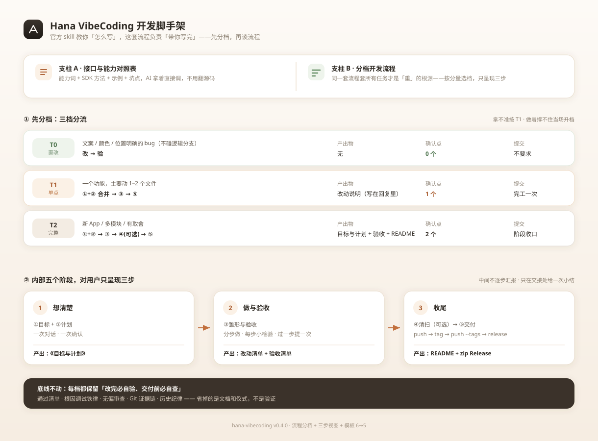
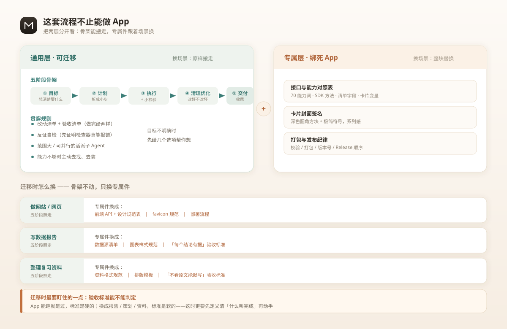

# Hana VibeCoding 开发脚手架（hana-vibecoding）

> 面向 vibe coding 的 Hana App 开发脚手架：**官方 skill 教你「怎么写」，这里负责「带你写完」。**



## 这是什么

一个给 [HanaAgent](https://github.com/liliMozi/openhanako) 用的 **skill（技能包）**，让不懂代码、靠说话让 AI 写 App 的人也能把 Hana App 做出来。解决两个实际痛点：

1. **AI 找不到接口**——权限开了，AI 却要自己翻源码才知道能调什么、怎么调。
   → 附一份《接口与能力对照表》，按"我要做 X"组织，AI 拿着直接调。

2. **开发容易跑偏**——边想边写、需求模糊、做完不收尾。
   → 一套**分档**流程陪着走：小活小走，大活全走；每步有引导、有产出、有小检验、有方法论撑腰。

**定位**：补充官方 `hana-app-creator`，**不替代、不重复**。官方那份是技术规格字典（573 行 SKILL.md + 3022 行 APPS.md），凡是它已写清的，本套只链接过去。

## 两个入口

### 入口 A · 接口与能力对照表

按"我想做的事"查，而不是按字母排：

| 我想… | 关键能力词 |
|---|---|
| 让 AI 在对话里调用我的功能 | `app/tools.expose-to-model` |
| 给用户一个能点的界面 | `app/ui.*` |
| 存数据 / 读写文件 | `app/resources.read/write` |
| 起子进程、联网、发通知 | `app/process.spawn` / `contributes.network` / `app/notifications.show` |
| 参与会话与拦截 | `app/hooks.*` |
| 开后端路由 / 原生窗口 / 输入面板 | — |

每个条目给出：**能力词、对应 SDK 方法、声明位置、最小示例、坑点**。所有方法名都核对过源码。

### 入口 B · 分档开发流程（配方法论）

**先分档，再谈流程**——同一套流程套所有任务，才是"重"的根源：

| 档 | 触发 | 走哪些环节 | 产出物 | 确认点 |
|---|---|---|---|---|
| **T0 直改** | 文案 / 颜色 / 位置明确的 bug，不碰逻辑分支 | 改 → 验 | 无 | 0 |
| **T1 单点** | 一个功能，主要动 1–2 个文件 | ①+②合并 → ③ → ⑤ | 改动说明（写在回复里） | 1 |
| **T2 完整** | 新 App / 多模块 / 有取舍 | ①+② → ③ → ④(可选) → ⑤ | 全套文档 + README | 2 |

拿不准按 T1；做着撑不住当场升档。内部仍是五个阶段名（方便对照方法论），**对用户只呈现三步**：

| 三步 | 含哪些阶段 | 产出 |
|---|---|---|
| **1 想清楚** | ①目标 + ②计划（一次对话、一次确认） | 《目标与计划》 |
| **2 做与验收** | ③雏形与验收 | 改动清单 + 验收清单 |
| **3 收尾** | ④清扫（可选）→ ⑤交付 | README / release |

每阶段末尾有一份 **3–5 条的通过清单**，短到能当场核对，不达标不进下一阶段。**省掉的是文档和仪式，不是验证。**

## 方法论从哪来

`references/methods.md` 是一份**方法论库**，吸收了 [Qoder](https://qoder.com) 那批开发类 skill 的精华，翻译成 Hana App 的语境：

| 来源 | 吸收了什么 | 挂在哪 |
|---|---|---|
| `create-plan` | story 拆分标准（fits-one-run + demo 边界） | 阶段② |
| `systematic-debugging` | 根因调试四阶段 + "没找到根因不许修"铁律 + 3 次换层规则 | 阶段③ |
| `requesting-code-review` | 无偏审查（派全新子 Agent，只给产物+需求） | 阶段③ |
| `analyze-code` | 代码原则 P1–P10 + 五级定级 | 阶段④ |
| `architecting` / `architecture-documenter` | 分层顺序、该拆的硬阈值、ADR 四段 | 阶段②④ |
| `ui-designer` / `frontend-design` / `stepfun-design` / `web-design-pro` | 设计系统骨架、反 AI 味清单、Token 三层、硬指标 | 阶段①③ |
| `git-commit` | 提交规范、确认门、双轨语言 | 阶段③⑤ |
| `self-improving-agent` | 经验沉淀触发清单、三层晋升 | 贯穿 |
| `ppt-visual-designer` | 信息组织三步（降维/飞轮/对比） | 阶段⑤ |
| `Writing-Skills` | 给 skill 做 TDD（RED-GREEN-REFACTOR） | 元方法 |

> 不是照搬文件，是**提炼要点、翻译语境**。每条都配「铁律 + 反合理化对照表」——比单纯写"应该做 X"抗干扰得多。

## 这套流程不止能做 App



五阶段骨架不是"App 开发流程"，而是**"把一个模糊想法做成可验收交付物"的通用节拍**。分两层看：

- **通用层（可迁移）**：五阶段骨架 + 贯穿规则 + `methods.md` 全部方法论——**换场景原样搬走**。
- **专属层（绑死 App）**：能力对照表、封面签名、打包发布纪律——**换场景整块替换**。

例如：做网站 → 专属件换成"前端 API + 设计规范"；写报告 → 换成"数据源清单 + 每个结论有据"；整理复习资料 → 换成"排版模板 + 不看原文能默写"。

**迁移时最要盯住的一点：验收标准能不能判定。** App 能跑就是过，标准是硬的；换成报告 / 策划 / 资料，标准是软的——这时更要先定义清"什么叫完成"再动手。

> 现阶段它是"App 开发 skill，但骨架可迁移"，不是"通用开发 skill"。等第二个场景真跑顺了，再考虑抽独立。

## 目录结构

```
hana-vibecoding/
├── docs/
│   ├── flow.svg            # 两大支柱：能力对照表 + 分档流程
│   └── layers.svg          # 通用层 / 专属层 分层图
├── skill/hana-vibecoding/  # ← 可直接安装的 skill 包（自包含）
│   ├── SKILL.md
│   ├── references/
│   │   ├── capability-map.md    # 任务导向的接口与能力对照表
│   │   ├── api-capabilities.md  # 70 能力词全量细节
│   │   ├── methods.md           # 方法论库（9 节，吸收自 Qoder）
│   │   ├── cover-guide.md       # 卡片封面统一签名规范
│   │   └── dev-lessons.md       # 静默失败清单 + 自验方法
│   └── templates/               # 产出模板（一份对应一个阶段）
│       ├── 01-brief.md          # ① 目标与计划（合在一张纸上）
│       ├── 03-changes.md        # ③ 改动清单
│       ├── 03-acceptance.md     # ③ 验收清单
│       ├── 04-optimize.md       # ④ 优化报告
│       └── 05-readme.md         # ⑤ README
└── 需求梳理稿.md            # 需求来龙去脉（过程记录）
```

## 安装

**方式一（推荐）**：从 [Releases](https://github.com/hayou2002/hana-vibecoding/releases) 下最新的 `hana-vibecoding-x.y.z.zip`，解包后在扩展管理界面点"本地安装"选中 `hana-vibecoding/` 目录（或走下面的命令）。

**方式二**：直接用本仓库里的源码目录（相当于自带最新版）。

**必须走扩展安装流程**，不能只复制文件夹——引擎认的是安装记录，光丢文件列表里看不见（踩过这个坑）。

在 Hana 里：

```
extension_manager install kind=skill source={type:"local", path:"<skill 目录>/hana-vibecoding"}
# → 拿到 stagedId
extension_manager confirm stagedId=<上一步的 id>
```

**这个 skill 默认不开启**（`default-enabled: false`）——它只在你要做 App 时被拉进来，平时不占你的上下文。

## 与官方 skill 的关系

| Skill | 干什么 | 关系 |
|---|---|---|
| `hana-app-creator`（官方） | App 开发技术规格 | 本套的"字典"，补充非替代 |
| `skill-creator`（官方） | 造 skill、跑 eval | 下沉开发流程时用 |
| `recipe-creator`（官方） | 提炼卡片 Recipe | 同类卡片复用 |
| **`hana-vibecoding`（本套）** | 分档流程 + 对照表 + 方法论库 | — |

## 自验

```bash
python <skill-creator>/scripts/quick_validate.py skill/hana-vibecoding
# → Skill is valid!
```

## 更新内容

### v0.4.0
**给流程分档——回应"完成一个任务要经历这么多环节"。**

问题不在环节本身，在**所有任务都套同一套环节**：改个颜色也要走目标书 → 计划 → 清单 → 优化报告 → README。

- **新增「三档分流」**：

  | 档 | 触发 | 走哪些环节 | 产出物 | 确认点 |
  |---|---|---|---|---|
  | **T0 直改** | 文案 / 颜色 / 位置明确的 bug | 改 → 验 | 无 | 0 |
  | **T1 单点** | 一个功能，主要动 1–2 个文件 | ①+②合并 → ③ → ⑤ | 改动说明 | 1 |
  | **T2 完整** | 新 App / 多模块 / 有取舍 | ①+② → ③ → ④(可选) → ⑤ | 目标书+计划+验收+README | 2 |

- **三个减重开关**（T2 也用）：
  1. **①② 只算一次确认**——目标和步骤一起给，一次点头，不分两次问
  2. **④ 从必经降为可选**——只有真发现死代码 / 重复 / 真 bug 才做；没发现就不做、不写报告
  3. **Git 只在关键节点提交**——不为"走流程"而提交
- **确认点从 4 个收到 2 个**（T2）：开工前 + 交付前，中间不打断。
- **T1 不写任何模板文档**：改动说明直接写在回复里。
- 底线不变：**每档都保留"改完必自验、交付前必自查"**——省掉的是文档和仪式，不是验证。
- **五个阶段，只给用户看三步**：

  | 三步 | 含哪些阶段 | 产出 |
  |---|---|---|
  | **1 想清楚** | ①目标 + ②计划（**一次**对话、**一次**确认） | 《目标与计划》 |
  | **2 做与验收** | ③雏形与验收 | 改动清单 + 验收清单 |
  | **3 收尾** | ④清扫（可选）→ ⑤交付 | README / release |

  阶段名保留（方便对照方法论文档），但每个标题都标了它属哪一步；**中间不逐步汇报**，只在三步交接处给一次小结。
- **两阶段合一份文档**：`01-goal.md` + `02-plan.md` → 合并为 `01-brief.md`（目标与计划一张纸），模板从 6 份减到 5 份。

### v0.3.0
**减重 + 把方法论变成硬卡点。**

- **默认不开启**（`default-enabled: false`）。之前它是唯一一直挂着的 skill，现在只在真正做 App 时才拉进来。
- **新增 §0 加载协议**：同一轮里最多读一份 references，能只读一节就不读全文；`api-capabilities.md`、`methods.md` 都配了「先 grep 拿行号、再只读那节」的两步法。
- **新增 §0.1 按分量走**：一句话能改完的小活走「轻量通道」（③→⑤），不再一律上全流程——这是回应"跑起来重"。
- **每阶段新增「通过清单」**：3–5 条，短到能当场核对。方法论不再指望"按需读"，而是在阶段里当场卡。
  > 依据：Qoder 那边的实测显示，`create-plan`/`systematic-debugging`/`requesting-code-review`/`analyze-code` 四个方法论类 skill 使用次数全是 0——"有但不强制"就是不会用。
- **新增 §Git 使用规范（贯穿 ③④⑤）**：
  - ③ 每过一个小检验 → 一次 commit，`git diff --stat` 直接当改动清单
  - ④ 优化**前后各一次** commit，`git diff 前..后` 就是"功能没变"的铁证
  - ⑤ `push → tag → push --tags → release`（顺序不能反）
  - 回复里必须用「命令 + `→` 结果」标出用了什么，不能只说"我提交了"
- **新增历史纪律**：`main` 上只留「每个版本一次提交 + 一张 tag」，开发碎提交 squash 掉；已公开的仓库不改写历史。
- Releases 附 zip，下载即装，不用自己 clone 再打包。

### v0.2.0
- 改名：`hana-app-devkit` → `hana-vibecoding`（面向 vibe coding，点明受众）
- 新增 `references/methods.md` 方法论库（9 节）：拆分标准、根因调试、无偏审查、代码原则、设计方法、架构决策、版本沉淀
- 吸收 Qoder 开发类 skill 的精华（13 个来源），翻译成 Hana App 语境
- 各阶段挂上对应方法论，配「铁律 + 反合理化对照表」

### v0.1.0
- 首个版本：五阶段流程 + 接口与能力对照表（70 能力词）
- 三份 references + 六个产出模板
- 可迁移性说明（通用层 / 专属层）
